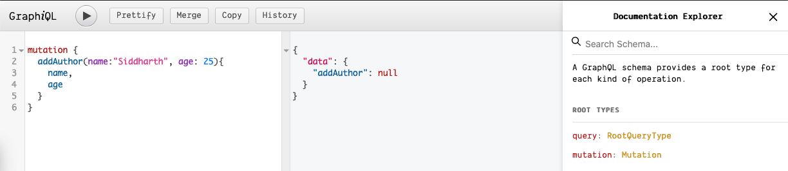

# Moving Ahead

## Create `author` and `book` models

Now that we have connected our db with mongoDB, we'll go ahead and create the data `models` for `author` and `book` in `models/` directory.

[author.js]

```js
const mongoose = require('mongoose');
const { Schema } = mongoose;

const authorSchema = new Schema({
  name: String,
  age: Number,
});

module.exports = mongoose.model('Author', authorSchema);
```

[book.js]

```js
const mongoose = require('mongoose');
const { Schema } = mongoose;

const bookSchema = new Schema({
  name: String,
  genre: String,
  authorID: String,
});

module.exports = mongoose.model('Book', bookSchema);
```

## Mutations

Mutation here means adding, deleting, updating, reading data from the db. It encompasses the basic CRUD methods.
CRUD stands for **C**reate, **R**ead, **U**pdate and **D**elete.

We'll create a `Mutation GraphQLObject` with fields as below:

```js
const Author = require('../models/author');

const Mutation = new GraphQLObjectType({
  name: 'Mutation',
  fields: {
    addAuthor: {
      type: AuthorType,
      args: {
        name: { type: GraphQLString },
        age: { type: GraphQLInt },
      },
      resolve(parent, args) {
        let author = new Author({
          name: args.name,
          age: args.age,
        });
        author.save();
      },
    },
  },
});

module.exports = new GraphQLSchema({
  query: RootQuery,
  mutation: Mutation,
});
```

Let's start up our app and check the mutation!

Run the command : `npm run dev`

Check the graphiql tool here : [localhost:4000/graphql](localhost:4000/graphql).

In the query section, provide the query:

```graphql
mutation {
  addAuthor(name: "Siddharth", age: 25) {
    name
    age
  }
}
```



On [mongodb cloud](https://cloud.mongodb.com), when we click collections in our cluster, we can see `authors` collection is created successfully.


So why aren't we receiving that same data in our `Graphiql` tool?

This is because we did not return the object after it was stored in the collection. When we call the `save()` function, mongo will return an object, and we can return this object.

So all we need to add in our `Mutation` object is:

```js
return author.save();
```

So now when we run our server and request the query from graphql, we get the desired result:

```json
{
  "data": {
    "addAuthor": {
      "name": "Siddharth",
      "age": 25
    }
  }
}
```


I've added 3 different authors on my db:


Let's do the same for books:

```js
const Mutation = new GraphQLObjectType({
  name: 'Mutation',
  fields: {
    // addAuthor

    addBook: {
      type: BookType,
      args: {
        name: { type: GraphQLString },
        genre: { type: GraphQLString },
        authorID: { type: GraphQLID },
      },
      resolve(parent, args) {
        let book = new Book({
          name: args.name,
          genre: args.genre,
          authorID: args.authorID,
        });
        return book.save();
      },
    },
  },
});
```

On the Graphiql tool, run the following query:

```graphql
mutation {
  addBook(name: "The Long Earth", genre: "Sci-Fi", authorID: "5eba7f6e9d1ddb1356b79ac0") {
    name
    genre
  }
}
```

This will result:

```json
{
  "data": {
    "addBook": {
      "name": "The Long Earth",
      "genre": "Sci-Fi"
    }
  }
}
```

To check if the mutation to add books has been done to the `books` collection, we can check it on the [mongo cloud](https://cloud.mongodb.com).


We'll add more books into the `books` collection from GraphQL.

## Connect MongoDB Atlas to Robo-3T

To connect your cluster from [MongoDB Atlas](https://cloud.mongodb.com), we need the connection string! This connection string will contain the address as well as the port to the MongoDB server.

To find your connection string:

- Click on 'Cluster0' or whatever name you've given to your cluster.
- In the overview panel, we can see 3 clusters, of which two are secondary and one is primary. Click on the primary cluster.
- We can see the cluster address as well as the port:
  `cluster0-shard-00-02-pyagm.mongodb.net:27017`
- Paste the address on the new connection window in the `address` text-box.
- Next, move to the `authentication` tab, and select `Perform authentication`. Enter the `username` and `password` you had set when creating the cluster!.
- Finally, move to the `SSL` tab, and select `Use SSL protocol`. Under `authentiation method`, select self-signed certificate`.

Great! You're good to go!

## Updating the `resolve()` functions

Since we're using the cloud db now, we do not need the `resolve()` function reeturning data from the local arrays anymore. Let's change that:

[schema.js]

```js
const BookType = new GraphQLObject({
  //code
  fields: () => {
    //code
    authorID: {
      //code
      resolve(parent, args){
        return Author.findById(parent.authorID);
      }
    }
  },
});

const AuthorType = new GraphQLObject({
  //code
  fields: () => {
    //code
    books: {
      //code
      resolve(parent, args){
        return Book.find({authorID: parent.id});
      }
    }
  },
});

//same in RootQuery as well. You get the idea.
```

Once we've done this, let's test it out!

**Query 1**

```graphql
{
  books {
    name
    genre
  }
}
```

```json
{
  "data": {
    "books": [
      {
        "name": "The Long Earth",
        "genre": "Sci-Fi"
      },
      {
        "name": "The Color of Magic",
        "genre": "Fantasy"
      },
      {
        "name": "The Light Fantastic",
        "genre": "Fantasy"
      },
      {
        "name": "The Final Empire",
        "genre": "Fantasy"
      },
      {
        "name": "The Hero of Ages",
        "genre": "Fantasy"
      },
      {
        "name": "Name of the Wind",
        "genre": "Fantasy"
      }
    ]
  }
}
```

**Query 2**

```graphql
{
  books {
    name
    genre
    authorID {
      name
      age
    }
  }
}
```

```json
{
  "data": {
    "books": [
      {
        "name": "The Long Earth",
        "genre": "Sci-Fi",
        "authorID": {
          "name": "Terry Pratchett",
          "age": 66
        }
      },
      {
        "name": "The Color of Magic",
        "genre": "Fantasy",
        "authorID": {
          "name": "Terry Pratchett",
          "age": 66
        }
      },
      {
        "name": "The Light Fantastic",
        "genre": "Fantasy",
        "authorID": {
          "name": "Terry Pratchett",
          "age": 66
        }
      },
      {
        "name": "The Final Empire",
        "genre": "Fantasy",
        "authorID": {
          "name": "Brandon Sanderson",
          "age": 42
        }
      },
      {
        "name": "The Hero of Ages",
        "genre": "Fantasy",
        "authorID": {
          "name": "Brandon Sanderson",
          "age": 42
        }
      },
      {
        "name": "Name of the Wind",
        "genre": "Fantasy",
        "authorID": {
          "name": "Patrick Rothfuss",
          "age": 44
        }
      }
    ]
  }
}
```

**Query 3**

```graphql
{
  authors {
    name
    age
    books {
      name
      genre
    }
  }
}
```

```json
{
  "data": {
    "authors": [
      {
        "name": "Patrick Rothfuss",
        "age": 44,
        "books": [
          {
            "name": "Name of the Wind",
            "genre": "Fantasy"
          }
        ]
      },
      {
        "name": "Brandon Sanderson",
        "age": 42,
        "books": [
          {
            "name": "The Final Empire",
            "genre": "Fantasy"
          },
          {
            "name": "The Hero of Ages",
            "genre": "Fantasy"
          }
        ]
      },
      {
        "name": "Terry Pratchett",
        "age": 66,
        "books": [
          {
            "name": "The Long Earth",
            "genre": "Sci-Fi"
          },
          {
            "name": "The Color of Magic",
            "genre": "Fantasy"
          },
          {
            "name": "The Light Fantastic",
            "genre": "Fantasy"
          }
        ]
      }
    ]
  }
}
```

**Query 4**

```graphql
{
  book(id: "5eba83174522923178f91872") {
    name
    genre
    authorID {
      name
      books {
        name
        genre
      }
    }
  }
}
```

```json
{
  "data": {
    "book": {
      "name": "The Color of Magic",
      "genre": "Fantasy",
      "authorID": {
        "name": "Terry Pratchett",
        "books": [
          {
            "name": "The Long Earth",
            "genre": "Sci-Fi"
          },
          {
            "name": "The Color of Magic",
            "genre": "Fantasy"
          },
          {
            "name": "The Light Fantastic",
            "genre": "Fantasy"
          }
        ]
      }
    }
  }
}
```

**Query 5**

```grahpql
{
  author(id:"5eba7f559d1ddb1356b79abf"){
    name
    age
    books {
      name
    }
  }
}
```

```json
{
  "data": {
    "author": {
      "name": "Brandon Sanderson",
      "age": 42,
      "books": [
        {
          "name": "The Final Empire"
        },
        {
          "name": "The Hero of Ages"
        }
      ]
    }
  }
}
```

## GraphQL NonNull

Let's say we want to add a new author, with only the `name` propeerty, and not pass any `age` property like so:

```graphql
mutation {
  addAuthor(name: "John") {
    name
  }
}
```

This will ideally contain the `age` property. If we want to avoid doing this or vice-versa, like adding a new author with `age` property and no name, it's a big problem. Let's see how we avoid this.

This is very simple. We'll use `GraphQLNonNull`, which says _"I will not accept null values for certain fields"_.

We'll change a few minor things in the `Mutation` object:

```js
const Mutation = new GraphQLObjectType({
  //code
  fields: {
    addAuthor: {
      //code
      args: {
        name: { type: new GraphQLNonNull(GraphQLString) },
        age: { type: new GraphQLNonNull(GraphQLInt) },
      },
    },
    addBook: {
      //code
      args: {
        name: { type: new GraphQLNonNull(GraphQLString) },
        genre: { type: new GraphQLNonNull(GraphQLString) },
        authorID: { type: new GraphQLNonNull(GraphQLID) },
      },
    },
  },
});
```

If we run a query like:

```graphql
mutation {
  addAuthor(name: "Jason") {
    name
  }
}
```

We'll get a squiggly line over `addAuthor` saying:
`Field "addAuthor" argument "age" of type "Int!" is required, but it was not provided`

This helps us in a huge way in avoiding bad data in our database.
